# 📖 BookHaven 3D

**A self-contained 3D e-book reader** — a web application that simulates a physical book in three-dimensional space. No build step, no Node.js, no npm — just a browser and Python.

> 🇷🇺 [Русская версия](README.ru.md)
>
> 🌐 **Live demo**: [129.151.144.75:8080](http://129.151.144.75:8080/)

## 🎬 Demo

> ⚠️ The media below is large — click to expand (high traffic, ~14 MB total).

<details>
<summary>▶️ 3D page-flip animation (GIF, ~4.7 MB)</summary>

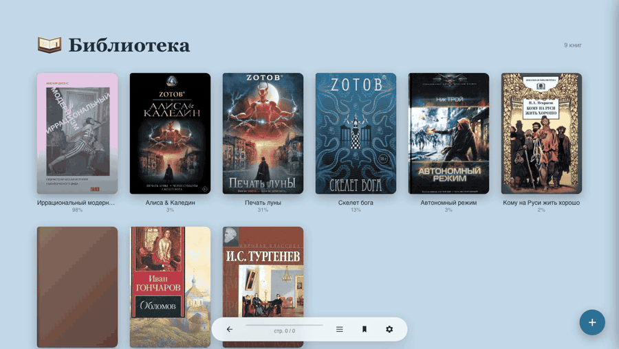

</details>

<details>
<summary>📱 Single-page mode on a phone (GIF, ~2.9 MB)</summary>

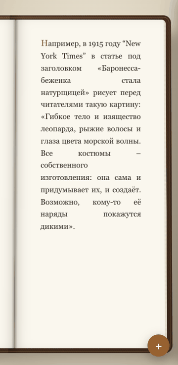

</details>

<details>
<summary>🎨 Themes and settings (GIF, ~6.2 MB)</summary>

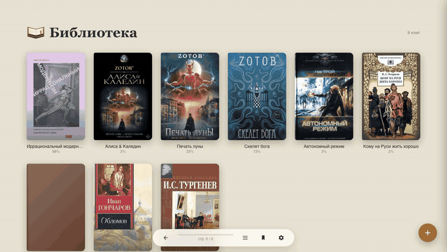

</details>

## 📸 Screenshots

<details>
<summary>🖼️ Show screenshots (13 images, ~8 MB total)</summary>

|                                                              |                                                            |
| ------------------------------------------------------------ | ---------------------------------------------------------- |
| 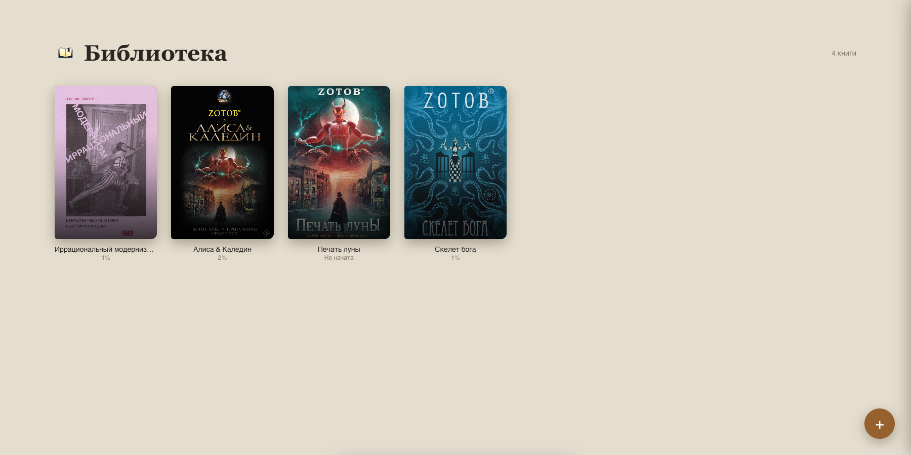                   | 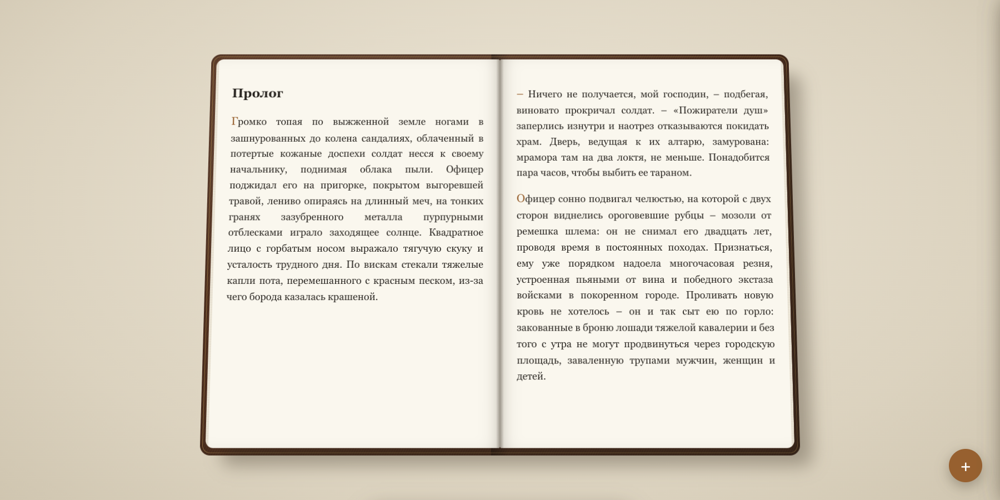                   |
|           | 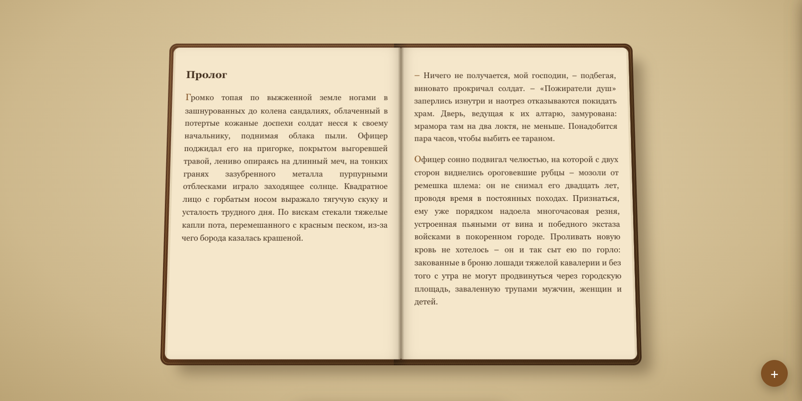        |
| 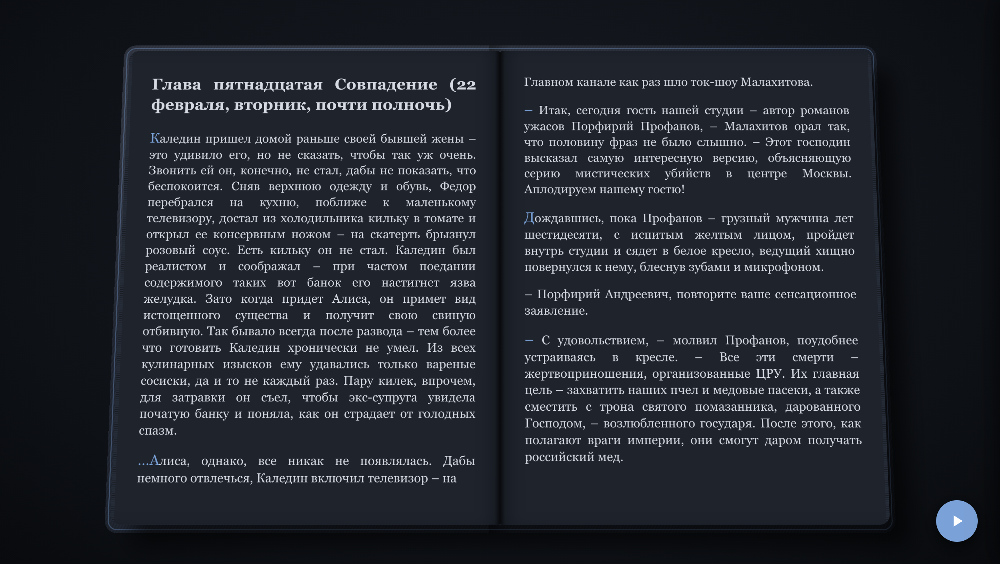          | 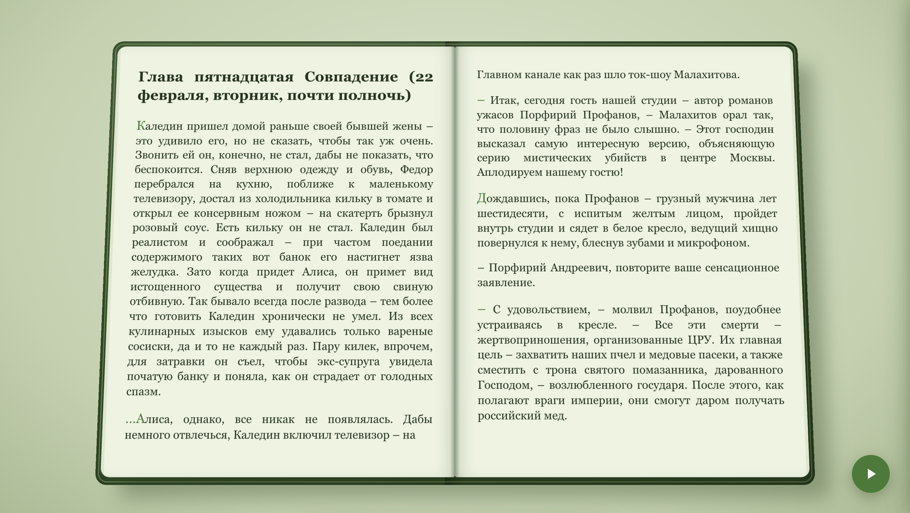      |
| 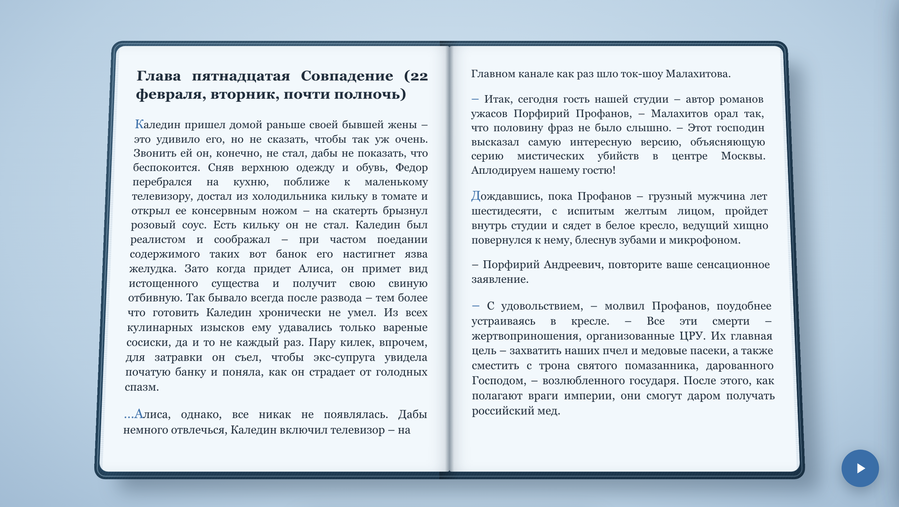              | 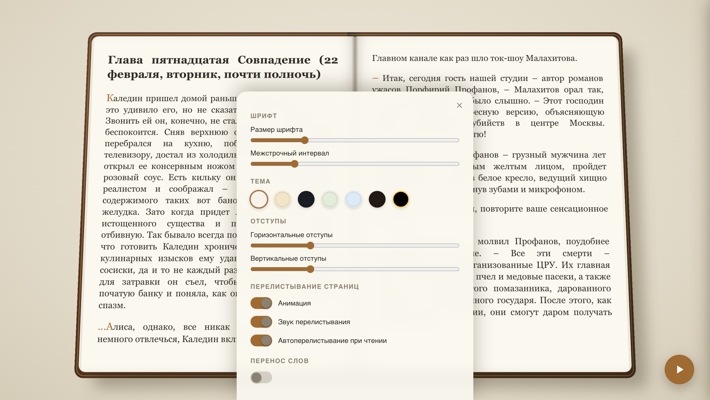               |
| 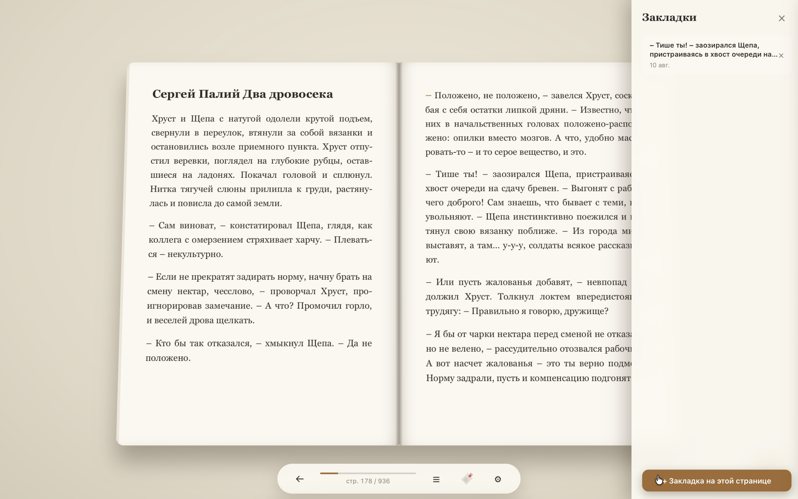               | 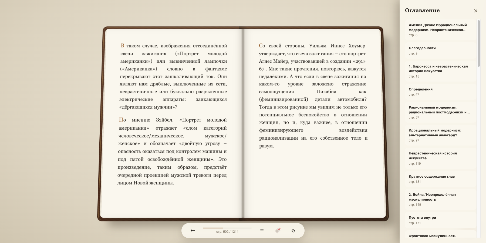           |
| 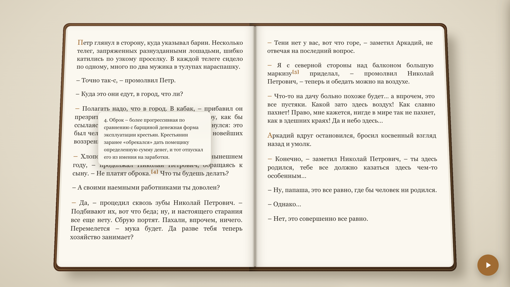 | 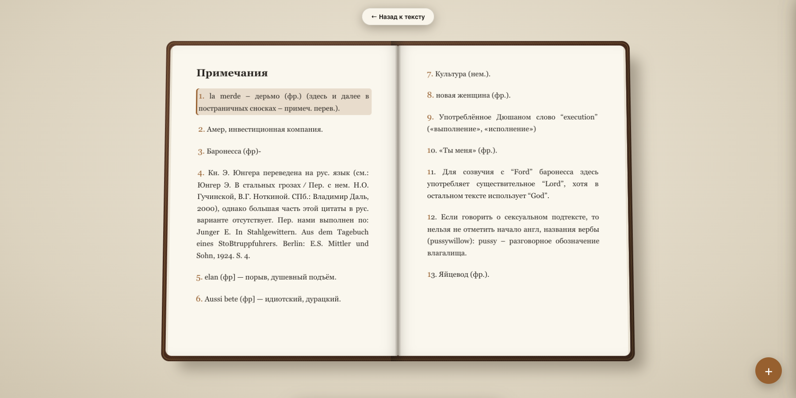 |
| 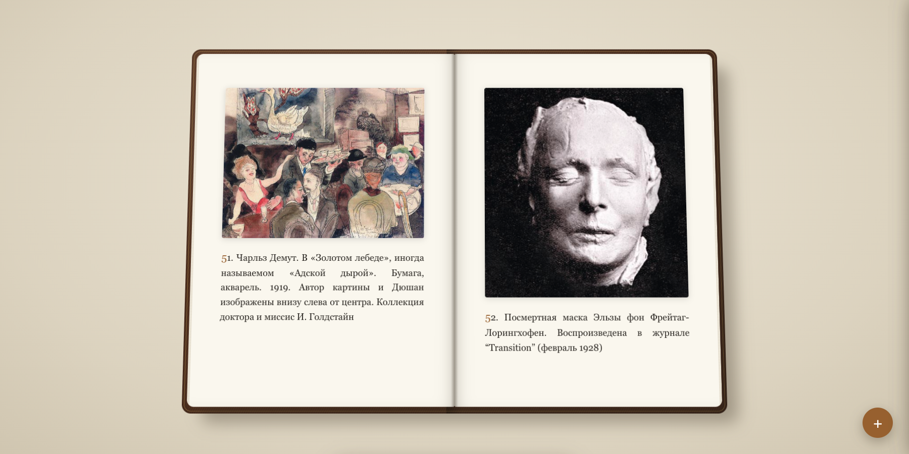           |                                                            |

</details>

## ✨ Features

### Reading

- 📕 **3D book spread** with page-flip animation (CSS 3D)
- 📱 **Single-page mode** — for tall/portrait screens only the right page is shown automatically
- 🖱️ **Interactive page turning** — grab the page corner with the mouse or your finger
- 👆 **Touch controls** — swipe left/right and wide tap zones on the screen edges
- 🔊 **Volume keys** — page turning inside an Android WebView wrapper (in a regular browser the OS intercepts them)
- ⌨️ **Navigation**: arrows, spacebar, Home/End, click zones on the sides
- 📄 **Dynamic layout** — text is split into pages according to screen size, font and margins
- 📍 **Position saving** — reopening a book returns you to where you left off (anchored to text, not page numbers)

### Narrator (read aloud)

- 🗣️ **Text-to-speech** — the narrator reads the book aloud using the built-in browser voices (Web Speech API, works offline)
- 📖 **Reads both pages** of the spread, then flips the page with animation and sound — just like manual reading
- 🎚️ **Stress marks** — a 3.2M-word Russian stress dictionary (RUAccent) marks the stressed vowel of every word, so the voice puts accents correctly («за́мок», not «замо́к»)
- 🎭 **Human-like pacing** — separate pauses after sentences, paragraphs, chapter titles and poem stanzas; headings are read slower, like an announcer
- 🧹 **Clean speech** — quotes and markup symbols are not read aloud, dashes become natural pauses
- ⏯️ **One button** — the FAB button starts/stops narration when a book is open (in the library it still adds books)
- 📄 **Auto-flip toggle** — optionally stop at the end of each page instead of turning automatically

### Page-flip sounds

- 🔊 **Paper rustle** on every page flip — a random sound from the `sounds/` folder (no repeats in a row)
- ➕ **Drop-in sounds** — add more MP3/OGG/WAV files into `sounds/`, they are picked up automatically, no code changes
- 🔈 **Toggle in settings** — sound can be turned off alongside the animation toggle

### Library

- 📚 **Card grid** with covers, title, author and reading progress
- ➕ **Adding books**: button, Drag & Drop
- 📂 **Formats**: TXT, EPUB, FB2
- 🗑️ **Deleting books** with confirmation
- 💾 **Server-side storage** — books live in the `books/` folder, metadata in `meta.json`

### Bookmarks

- 🔖 **Add/remove bookmarks** with text preview
- 📑 **Side panel** with the list, click to jump to the location
- 🎯 **Marker on the book edge** — visual bookmark indicator

### Table of Contents

- 📃 **Chapter navigation** — jump to any chapter from the TOC panel

### Settings

- 🔤 **Font size**, line height, horizontal & vertical margins
- 🎨 **7 themes**: Paper, Sepia, Night, Forest, Sky, Ember (OLED), Amber (OLED)
- 🌙 **Immersive mode** — clicking the center hides all panels
- 🔤 **Hyphenation** toggle
- 🎞️ **Page-flip animation** and **flip sound** toggles
- 📄 **Auto-flip during narration** toggle

## 📱 Phone controls

- **Tap the screen edges** — right/left edges flip forward/back (zones widen automatically on touch screens)
- **Swipe** — swipe left to go forward, right to go back
- **Volume keys** — in a regular browser the OS intercepts them, so flipping works inside an **Android WebView wrapper**. The wrapper can control the reader in three ways (implementation: `js/reader.js`, `_bindVolumeKeys`):

| Way       | How to do it in the wrapper                                                                                      |
| --------- | ---------------------------------------------------------------------------------------------------------------- |
| JS bridge | Call`window.BookHavenNative.volumeUp()` / `.volumeDown()` (e.g. via `evaluateJavascript` in `onKeyDown`) |
| Event     | Dispatch`window.dispatchEvent(new Event('volumeup'))` / `('volumedown')`                                     |
| Key       | Forward a`keydown` with `keyCode` 175 (louder) / 174 (quieter) to the WebView                                |

## 🚀 Quick start

```bash
# Start the server (static + API in one file)
python3 server.py

# Open in browser
http://127.0.0.1:8080
```

The server runs two processes in threads:

- **8080** — static files (HTML/CSS/JS)
- **8001** — API for saving state and books

Options:

```bash
python3 server.py          # both servers
python3 server.py --static # static only (8080)
python3 server.py --api    # API only (8001)
```

## 📁 Project structure

```
book_reader/
├── index.html          # Entry point, UI markup
├── server.py           # Single server: static + API
├── css/
│   ├── main.css        # Global styles, themes (CSS Custom Properties)
│   ├── reader.css      # 3D reader scene, bookmarks
│   └── library.css     # Library (card grid)
├── js/
│   ├── main.js         # Initialization, pagination, state, autosave
│   ├── reader.js       # Reader: flip animation, drag, keyboard, volume keys
│   ├── library.js      # Library: cards, import, deletion
│   ├── bookmarks.js    # Bookmarks (side panel, marker on the book edge)
│   ├── notes.js        # Footnotes: tooltip, jump to note, "back" button
│   ├── parsers.js      # TXT/EPUB parsers (FB2 — server-side)
│   ├── position.js     # Reading anchors (data-block-id)
│   ├── toc.js          # Table of contents
│   └── storage.js      # localStorage + server-side saving
├── lib/
│   ├── epub.js         # epub.js (downloaded, BSD)
│   └── jszip.min.js    # JSZip — epub.js dependency
├── assets/             # Screenshots and GIF animations for the README
├── books/              # Book catalog (created automatically)
│   ├── <name>.fb2 / .txt / .epub   # Book file with its original name
│   └── <name>.meta.json            # Metadata next to the book file
└── data/
    └── state.json      # Global settings (created automatically)
```

## 🔧 How it works

### Pagination

Text is split into pages in the browser: a hidden measurer computes the height of each paragraph under the current font settings, then paragraphs are laid out into pages. Each paragraph gets a stable identifier (`data-block-id`) tied to the book and its sequential number — so the reading position does not "drift" when settings change.

### Data storage

Books are stored as **plain files** in `books/` — the original filename is kept, no subfolders. Metadata (progress, bookmarks, covers) is stored in `<name>.meta.json` next to the book.

| What                                | Where                                  |
| ----------------------------------- | -------------------------------------- |
| Books (originals)                   | `books/<name>.fb2 / .txt / .epub`    |
| Book metadata (progress, bookmarks) | `books/<name>.meta.json`             |
| Global settings                     | `localStorage` + `data/state.json` |

### API

| Method     | Path                         | Description                                |
| ---------- | ---------------------------- | ------------------------------------------ |
| `GET`    | `/books`                   | List of books (metadata without text)      |
| `POST`   | `/books`                   | Save a book (copies into`books/`)        |
| `GET`    | `/books/<id>/text`         | Book text (FB2 parsed on the fly)          |
| `GET`    | `/books/<id>/meta`         | Book metadata                              |
| `POST`   | `/books/<id>/meta`         | Update progress/bookmarks                  |
| `GET`    | `/books/<id>/cover`        | Book cover (from FB2`<coverpage>`)       |
| `GET`    | `/books/<id>/image/<name>` | Image from the book body (FB2`<binary>`) |
| `DELETE` | `/books/<id>`              | Delete a book                              |
| `GET`    | `/sounds`                  | List of page-flip sound files              |
| `POST`   | `/tts/stress`               | Mark up text with stress accents (U+0301) for the narrator |

## 📋 Tech stack

- **Frontend**: vanilla ES2022 JavaScript, CSS3 Custom Properties, CSS 3D transforms
- **Backend**: Python `http.server` (no dependencies)
- **Libraries**: epub.js + JSZip (bundled in `/lib/`)
- **TTS**: Web Speech API (browser voices) + RUAccent stress dictionary (3.2M word forms)
- **Icons**: inline SVG (Material Design paths)

## 📄 License

**Dual licensing** — see [LICENSE.md](LICENSE.md):

- 🆓 **Personal use — free**: read, install on your devices, modify for
  yourself, share with others for personal use.
- 💼 **Commercial use — paid license**: selling, embedding into
  commercial products/services, monetized hosting, using the code in
  commercial projects — requires purchasing a license from the author.

Applies to the repository version dated September 1, 2026 and later.

Third-party libraries: epub.js (BSD-3-Clause), JSZip (MIT/GPLv3).

> 📚 **About the books in the screenshots**: the demo uses free preview versions of books from [LitRes](https://www.litres.ru/) (a Russian e-book store) and a public-domain art book. They are shown for demonstration purposes only and are not distributed with the project.
