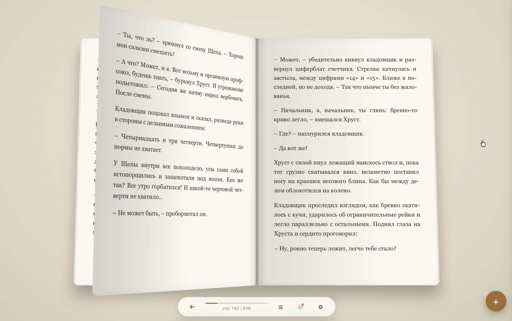
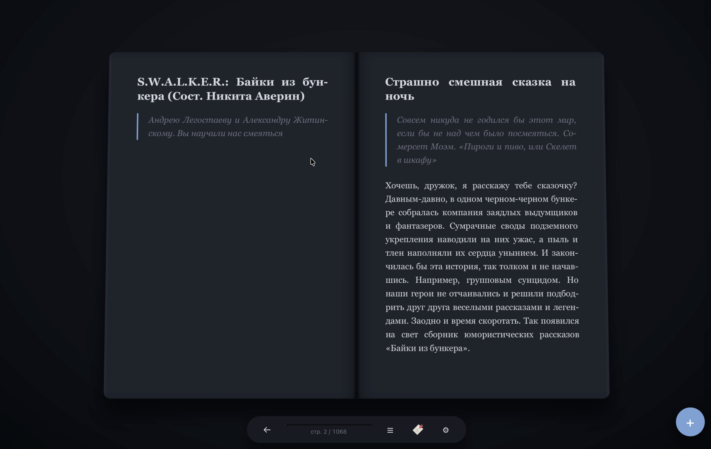

# 📖 BookHaven 3D

**A self-contained 3D e-book reader** — a web application that simulates a physical book in three-dimensional space. No build step, no Node.js, no npm — just a browser and Python.

> 🇷🇺 [Русская версия](README.ru.md)

## 🎬 Demo

> ⚠️ The media below is large — click to expand (high traffic, ~35 MB total).

<details>
<summary>▶️ Page-flip animation (GIF, ~9 MB)</summary>


</details>

<details>
<summary>🎥 Full video demo (MP4, ~26 MB)</summary>

<video src="assets/video/demo.mp4" controls width="700"></video>

</details>

## 📸 Screenshots

<details>
<summary>🖼️ Show screenshots (6 images, ~13 MB total)</summary>

| | |
|---|---|
|  |  |
|  |  |
|  |  |

</details>

## ✨ Features

### Reading
- 📕 **3D book spread** with page-flip animation (CSS 3D)
- 📱 **Single-page mode** — for tall/portrait screens only the right page is shown automatically
- 🖱️ **Interactive page turning** — grab the page corner with the mouse or your finger
- 👆 **Touch controls** — swipe left/right and wide tap zones on the screen edges
- 🔊 **Volume keys** — page turning inside an Android WebView wrapper (in a regular browser the OS intercepts them)
- ⌨️ **Navigation**: arrows, spacebar, Home/End, click zones on the sides
- 📄 **Dynamic layout** — text is split into pages according to screen size, font and margins
- 📍 **Position saving** — reopening a book returns you to where you left off (anchored to text, not page numbers)

### Library
- 📚 **Card grid** with covers, title, author and reading progress
- ➕ **Adding books**: button, Drag & Drop
- 📂 **Formats**: TXT, EPUB, FB2
- 🗑️ **Deleting books** with confirmation
- 💾 **Server-side storage** — books live in the `books/` folder, metadata in `meta.json`

### Bookmarks
- 🔖 **Add/remove bookmarks** with text preview
- 📑 **Side panel** with the list, click to jump to the location
- 🎯 **Marker on the book edge** — visual bookmark indicator

### Table of Contents
- 📃 **Chapter navigation** — jump to any chapter from the TOC panel

### Settings
- 🔤 **Font size**, line height, margins
- 🎨 **5 themes**: Paper, Sepia, Night, Forest, Sky
- 🌙 **Immersive mode** — clicking the center hides all panels

## � Phone controls

- **Tap the screen edges** — right/left edges flip forward/back (zones widen automatically on touch screens)
- **Swipe** — swipe left to go forward, right to go back
- **Volume keys** — in a regular browser the OS intercepts them, so flipping works inside an **Android WebView wrapper**. The wrapper can control the reader in three ways (implementation: `js/reader.js`, `_bindVolumeKeys`):

| Way | How to do it in the wrapper |
|-----|-----------------------------|
| JS bridge | Call `window.BookHavenNative.volumeUp()` / `.volumeDown()` (e.g. via `evaluateJavascript` in `onKeyDown`) |
| Event | Dispatch `window.dispatchEvent(new Event('volumeup'))` / `('volumedown')` |
| Key | Forward a `keydown` with `keyCode` 175 (louder) / 174 (quieter) to the WebView |

## �🚀 Quick start

```bash
# Start the server (static + API in one file)
python3 server.py

# Open in browser
http://127.0.0.1:8080
```

The server runs two processes in threads:
- **8080** — static files (HTML/CSS/JS)
- **8001** — API for saving state and books

Options:
```bash
python3 server.py          # both servers
python3 server.py --static # static only (8080)
python3 server.py --api    # API only (8001)
```

## 📁 Project structure

```
book_reader/
├── index.html          # Entry point, UI markup
├── server.py           # Single server: static + API
├── css/
│   ├── main.css        # Global styles, themes (CSS Custom Properties)
│   ├── reader.css      # 3D reader scene, bookmarks
│   └── library.css     # Library (card grid)
├── js/
│   ├── main.js         # Initialization, pagination, state, autosave
│   ├── reader.js       # Reader: flip animation, drag, keyboard
│   ├── library.js      # Library: cards, import, deletion
│   ├── bookmarks.js    # Bookmarks and notes
│   ├── parsers.js      # TXT/EPUB parsers (FB2 — server-side)
│   ├── position.js     # Reading anchors (data-block-id)
│   ├── toc.js          # Table of contents
│   └── storage.js      # localStorage + server-side saving
├── lib/
│   ├── epub.js         # epub.js (downloaded, BSD)
│   └── jszip.min.js    # JSZip — epub.js dependency
├── books/              # Book catalog (created automatically)
│   ├── <name>.fb2 / .txt / .epub   # Book file with its original name
│   └── <name>.meta.json            # Metadata next to the book file
└── data/
    └── state.json      # Global settings (created automatically)
```

## 🔧 How it works

### Pagination
Text is split into pages in the browser: a hidden measurer computes the height of each paragraph under the current font settings, then paragraphs are laid out into pages. Each paragraph gets a stable identifier (`data-block-id`) tied to the book and its sequential number — so the reading position does not "drift" when settings change.

### Data storage
Books are stored as **plain files** in `books/` — the original filename is kept, no subfolders. Metadata (progress, bookmarks, covers) is stored in `<name>.meta.json` next to the book.

| What | Where |
|------|-------|
| Books (originals) | `books/<name>.fb2 / .txt / .epub` |
| Book metadata (progress, bookmarks) | `books/<name>.meta.json` |
| Global settings | `localStorage` + `data/state.json` |

### API
| Method | Path | Description |
|--------|------|-------------|
| `GET` | `/books` | List of books (metadata without text) |
| `POST` | `/books` | Save a book (copies into `books/`) |
| `GET` | `/books/<id>/text` | Book text (FB2 parsed on the fly) |
| `GET` | `/books/<id>/meta` | Book metadata |
| `POST` | `/books/<id>/meta` | Update progress/bookmarks |
| `DELETE` | `/books/<id>` | Delete a book |

## 📋 Tech stack

- **Frontend**: vanilla ES2022 JavaScript, CSS3 Custom Properties, CSS 3D transforms
- **Backend**: Python `http.server` (no dependencies)
- **Libraries**: epub.js + JSZip (bundled in `/lib/`)

## 🗺️ Roadmap

- [x] Book grid, TXT/EPUB/FB2 import, deletion
- [x] 3D page-flipping, keyboard, drag
- [x] Progress, bookmarks, themes, settings
- [x] Server-side storage of books and metadata
- [x] Table of contents / jump to chapter
- [ ] Search and tags in the library
- [ ] PWA (Service Worker, offline)
- [x] Mobile adaptation (swipes, tap zones, volume keys)
- [ ] WebGL renderer with page bending

## 📄 License

The project is built from a custom specification. Third-party libraries: epub.js (BSD-3-Clause), JSZip (MIT/GPLv3).
